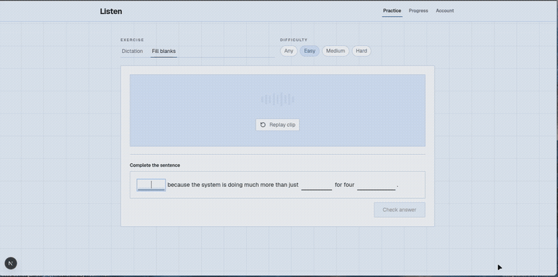

<h1 align="center">Listen</h1>
<h3 align="center">The calmer way to get better at hearing real English</h3>



Listen is a small dictation app built around the part of language learning that is annoyingly hard to fake: understanding what somebody actually said at normal speed.

You get a short clip from a real YouTube video, listen as many times as you need, and either type the whole sentence or fill in a few missing words. Listen checks your answer locally, shows exactly what changed, and moves straight on to the next clip.


## Development

If you already have Docker, this is the shortest way to a working development setup:

```bash
docker compose up --build
```

That starts PostgreSQL, pushes the schema, and runs the Next.js development server with hot reload at [http://localhost:3000](http://localhost:3000). Source files stay mounted from the host; `node_modules`, the Next.js cache, and database data live in named volumes so Linux dependencies do not leak into your local checkout.

The database starts empty. Fill it once using this command

```bash
docker compose exec app npm run index
```

That's it, enojy :)